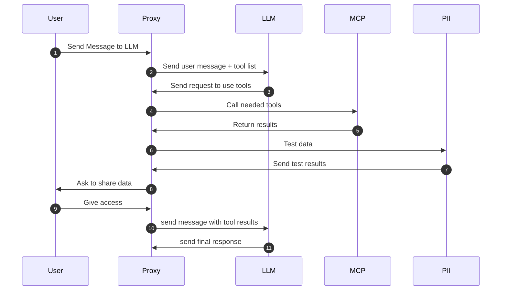

## Requirments
- Add ability to make MCP calls for external LLM providers
- Run PII checks
- Ask user's access for sharing sensitive information

**Sequence Diagram for success path**

## Implementation Details
The project will be built using Scala + ZIO stack
### MCP injection
Data about available tools will be provided to open ai using [Function Calling](https://platform.openai.com/docs/guides/function-calling)
Such feature is supported in the [official SDK](https://github.com/openai/openai-java) which is going to be used for interactions
[Official MCP SDK|https://github.com/modelcontextprotocol/java-sdk] will be used for communcations with MCP server

Supported MCP servers are specified via configuration. Adding a new MCP server requires a restart.

### PII module
