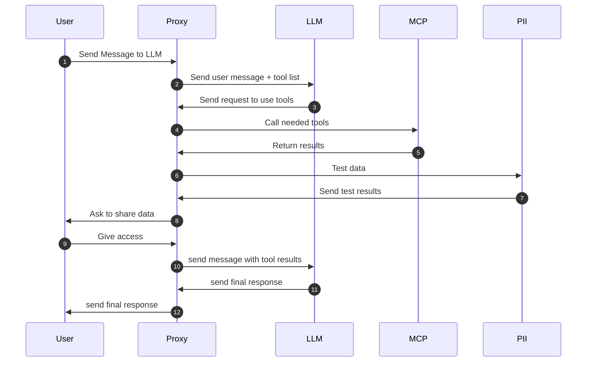
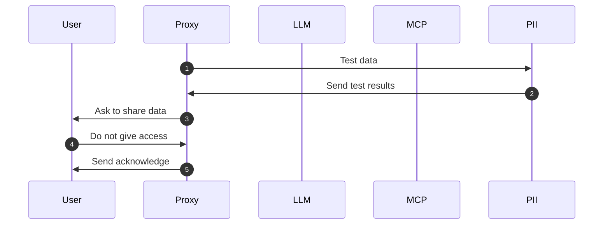

# Project Description
The proxy enables integration between OpenAI chat models and local MCP servers via [Function Calling](https://platform.openai.com/docs/guides/function-calling), allowing 
custom PII checks for sensitive data verification

# MCP Proxy MVP Specification

## Requirements
- Add the ability to make MCP calls for OpenAI models
- Run PII checks for the data provided to LLM
- Ask the user for access to share sensitive information with LLM
- No authentication mechanism is required
- No metrics are required
- No strict SLA's

**Prerequisites**
* OpenAI chat models with tool‑calling support.

**Tradeoffs**
- The app is stateful, with an in-memory persistence layer: 
  - In the case of a crash or a restart, users' workflow will be lost
  - The app is not horizontally scalable
- Supported MCP servers are specified via configuration and stored in-memory. 
  - Adding a new MCP server requires a restart.
- PII detection supports EN language only
- If sensitive data is found, it will not be provided to users for direct verification. \
  Users will only know that the data is sensitive, and they can either grant LLM access or deny it
- If the data retrieved from the MCP servers is out of the context window, the app will return an error to the user and stop the dialog

**Full Sequence Diagram for success path**

In the case if the user doesn't want to share sensitive information, the entire dialog will be stopped:

## Implementation Details
The project will be built using Scala + ZIO stack

### Error Handling
* Return 400 HTTP code in the case of an invalid user's input
* Return 413 HTTP code if the data retrieved from the MCP servers is more than the context window
* Return 502 HTTP code in case the MCP or LLM servers have not responded
* Return 500 HTTP  code to a user in the case of any other error
* Log to the console for investigation purposes

### MCP injection
* Data about available MCP servers will be provided to model using [Function Calling](https://platform.openai.com/docs/guides/function-calling)
* _Tools_ feature is supported in the [official Java SDK](https://github.com/openai/openai-java) which is going to be used for interactions with the model
* [Official MCP Java SDK](https://github.com/modelcontextprotocol/java-sdk) will be used for communications with MCP server

### PII module
* PII check will be based on regex and encapsulated for future extensions
* PII module just verify if data is sensitive, it will not mask or remove data from the request
